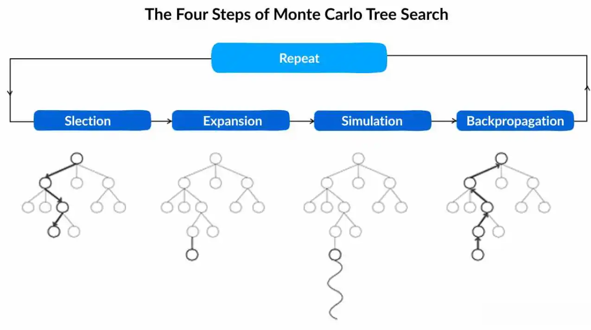

# Monte Carlo Tree Search

MCTS simulates possible game outcomes to select an action:

1. Select a promising path with UCB1.
2. Expand an untested action.
3. Simulate the game with sampled cards and an agent policy.
4. Backpropagate the reward.

The most visited root action is selected. Searches use copied game states, so
the real game is not modified.

## Files

- `search.py` and `node.py` — generic MCTS
- `flip7_model.py` — simulated Flip 7 rules
- `state.py` and `state_factory.py` — search state
- `agent_adapter.py` — agents used in simulations
- `../agents/mcts_agent.py` — game integration
